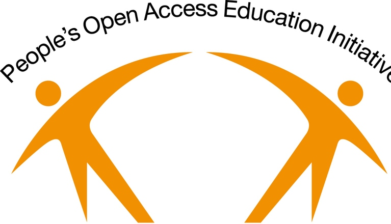

## THE PEOLPES-UNI

Capacity Building in Public Health through online learning 2006-2021

Peoples-uni was established as an educational charity designed to build Public Health capacity in low- to middle-income countries (LMICs) through online learning. Using open source software, Open Educational Resources and volunteer tutors, the programme produced a number of successful outcomes. This legacy website describes the history and achievements of the programme.

## Major Achievement

-  Volunteer expert tutors from 55 countries

-  Students from more than 100 countries (70% from Africa)

-  159 Public Health master’s graduates from Peoples-uni, or its partners Manchester Metropolitan University and Euclid University

-  Many more students took individual modules or courses for their continuing professional development including 7000 enrolments on the Peoples-uni Open Online Courses site

-  An active Alumni group with a number of peer reviewed collaborative publications and a number of Alumni joining as tutors

-  A set of publications in the peer reviewed literature describing and evaluating the Peoples-uni experience of delivering high quality and low cost Public Health capacity building to health professionals in low- to middle-income countries

## The future

We plan to build on these achievements and our original objectives, in particular working with master’s level graduates, to support global efforts to accelerate the development of much needed public health capacity.

Peoples-uni closed in March 2021 following transfer of all its courses to NextGenU.org – to whom enquiries for further study should be made.

## Our Sincere Thanks

Our sincere thanks to all the volunteers and partners who supported us in various ways and helped show that there is an affordable way to deliver quality education and build public health capacity globally. We wish all of them and all the students and alumni the best in their future plans.
